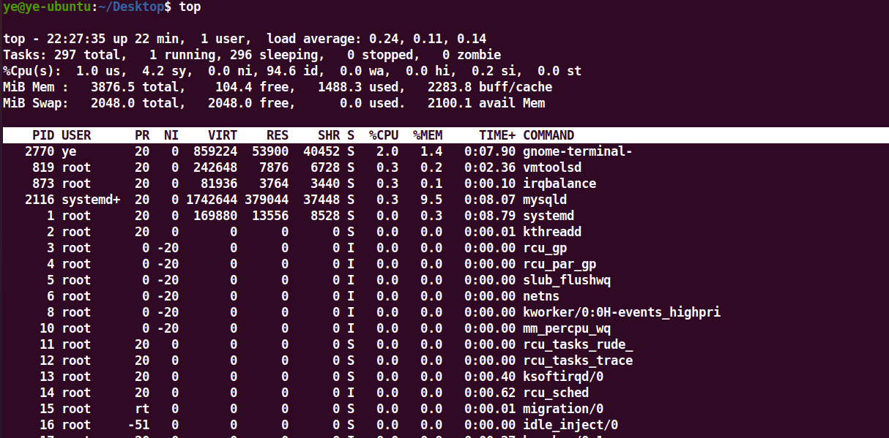
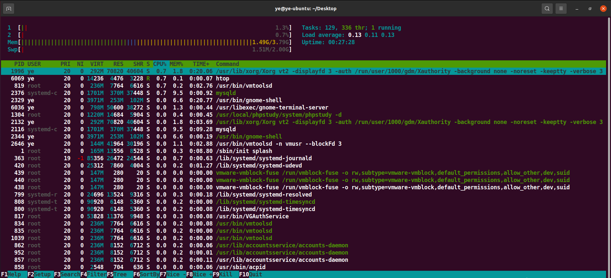
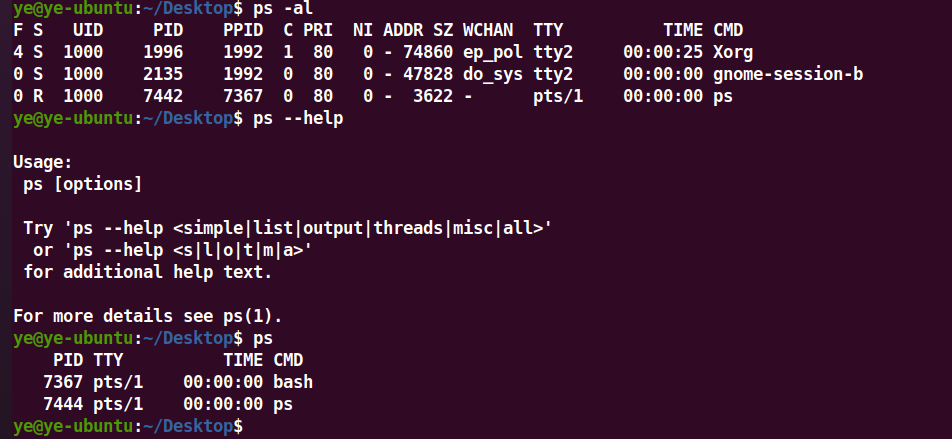
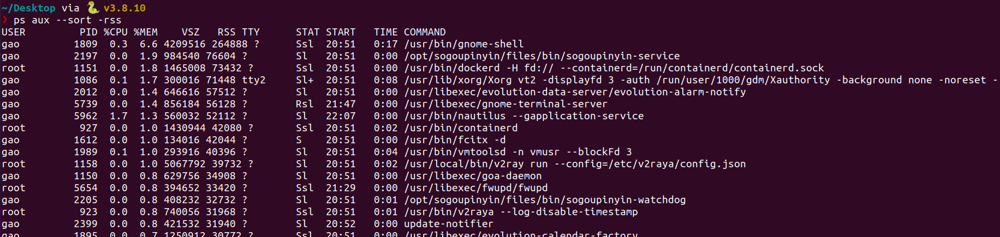
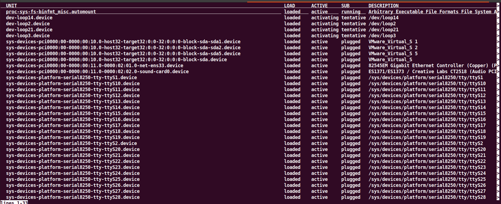
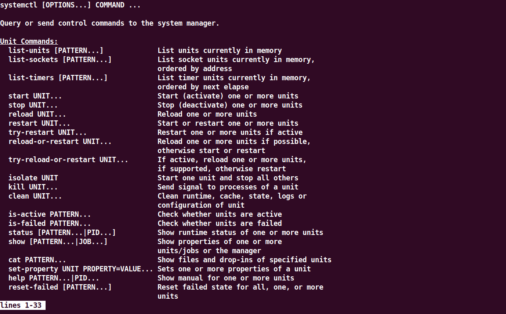
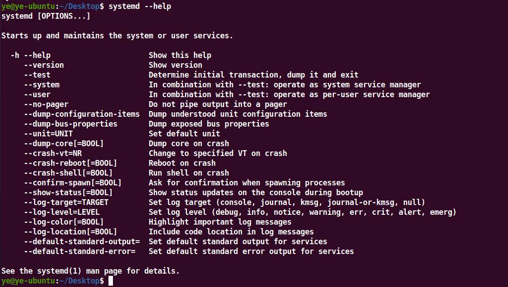
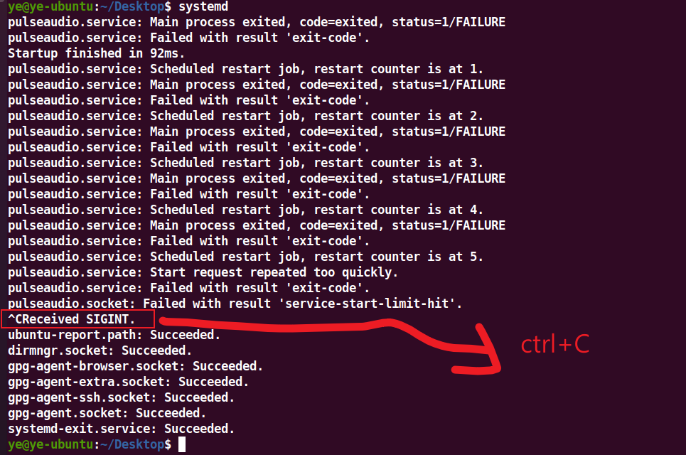

# Linux命令

## 修改系统时间

```bash
ye@ye-ubuntu:~/Desktop$ timedatectl 
               Local time: 五 2024-06-28 22:05:33 CST
           Universal time: 五 2024-06-28 14:05:33 UTC
                 RTC time: 五 2024-06-28 14:05:33    
                Time zone: Asia/Shanghai (CST, +0800)
System clock synchronized: no                        
              NTP service: active                    
          RTC in local TZ: no                        

ye@ye-ubuntu:~/Desktop$ timedatectl -h
timedatectl [OPTIONS...] COMMAND ...

Query or change system time and date settings.

Commands:
  status                   Show current time settings
  show                     Show properties of systemd-timedated
  set-time TIME            Set system time
  set-timezone ZONE        Set system time zone
  list-timezones           Show known time zones
  set-local-rtc BOOL       Control whether RTC is in local time
  set-ntp BOOL             Enable or disable network time synchronization

systemd-timesyncd Commands:
  timesync-status          Show status of systemd-timesyncd
  show-timesync            Show properties of systemd-timesyncd

Options:
  -h --help                Show this help message
     --version             Show package version
     --no-pager            Do not pipe output into a pager
     --no-ask-password     Do not prompt for password
  -H --host=[USER@]HOST    Operate on remote host
  -M --machine=CONTAINER   Operate on local container
     --adjust-system-clock Adjust system clock when changing local RTC mode
     --monitor             Monitor status of systemd-timesyncd
  -p --property=NAME       Show only properties by this name
  -a --all                 Show all properties, including empty ones
     --value               When showing properties, only print the value

See the timedatectl(1) man page for details.
```


## 查看系统信息

### lsb_release

如图

```bash
~/Desktop via 🐍 v3.8.10 
❯ lsb_release --help
Usage: lsb_release [options]

Options:
  -h, --help         show this help message and exit
  -v, --version      show LSB modules this system supports
  -i, --id           show distributor ID
  -d, --description  show description of this distribution
  -r, --release      show release number of this distribution
  -c, --codename     show code name of this distribution
  -a, --all          show all of the above information
  -s, --short        show requested information in short format

~/Desktop via 🐍 v3.8.10 
❯ lsb_release --version
No LSB modules are available.

~/Desktop via 🐍 v3.8.10 
❯ lsb_release -a
No LSB modules are available.
Distributor ID:	Ubuntu
Description:	Ubuntu 20.04.6 LTS
Release:	20.04
Codename:	focal
```


### /etc/os-release

如图

``` bash
~/Desktop via 🐍 v3.8.10 
❯ cat /etc/os-release 
NAME="Ubuntu"
VERSION="20.04.6 LTS (Focal Fossa)"
ID=ubuntu
ID_LIKE=debian
PRETTY_NAME="Ubuntu 20.04.6 LTS"
VERSION_ID="20.04"
HOME_URL="https://www.ubuntu.com/"
SUPPORT_URL="https://help.ubuntu.com/"
BUG_REPORT_URL="https://bugs.launchpad.net/ubuntu/"
PRIVACY_POLICY_URL="https://www.ubuntu.com/legal/terms-and-policies/privacy-policy"
VERSION_CODENAME=focal
UBUNTU_CODENAME=focal
```


## 查看磁盘

### df

简明说明：产看磁盘空间使用信息

```bash
ye@ye-ubuntu:~/Desktop$ df -h
Filesystem      Size  Used Avail Use% Mounted on
udev            1.9G     0  1.9G   0% /dev
tmpfs           388M  3.4M  385M   1% /run
/dev/sda5        98G   47G   46G  51% /
tmpfs           1.9G     0  1.9G   0% /dev/shm
tmpfs           5.0M  4.0K  5.0M   1% /run/lock
tmpfs           1.9G     0  1.9G   0% /sys/fs/cgroup
/dev/loop0      128K  128K     0 100% /snap/bare/5
/dev/loop1       56M   56M     0 100% /snap/core18/2812
/dev/loop2       56M   56M     0 100% /snap/core18/2796
/dev/loop3       75M   75M     0 100% /snap/core22/1033
/dev/loop5      347M  347M     0 100% /snap/gnome-3-38-2004/119
/dev/loop6      350M  350M     0 100% /snap/gnome-3-38-2004/143
/dev/loop4       75M   75M     0 100% /snap/core22/1122
/dev/loop7       64M   64M     0 100% /snap/core20/2264
/dev/loop10     506M  506M     0 100% /snap/gnome-42-2204/176
/dev/loop9       64M   64M     0 100% /snap/core20/2182
/dev/loop8      505M  505M     0 100% /snap/gnome-42-2204/172
/dev/loop11      92M   92M     0 100% /snap/gtk-common-themes/1535
/dev/loop13     121M  121M     0 100% /snap/qv2ray/4729
/dev/loop14      40M   40M     0 100% /snap/snapd/21184
/dev/loop12      13M   13M     0 100% /snap/snap-store/959
/dev/loop15      13M   13M     0 100% /snap/snap-store/1113
/dev/loop16      39M   39M     0 100% /snap/snapd/21465
/dev/loop19      21M   21M     0 100% /snap/v2raya/30
/dev/loop17     217M  217M     0 100% /snap/urh/9
/dev/loop18      21M   21M     0 100% /snap/v2raya/28
/dev/sda1       511M  4.0K  511M   1% /boot/efi
tmpfs           388M   20K  388M   1% /run/user/1000
/dev/loop20      39M   39M     0 100% /snap/snapd/21759

```

通过`df`命令查看的磁盘信息，显示了文件系统的挂载点、总容量、已用容量、可用容量、使用率等。以下是对各列的解释和具体信息的说明：

#### 各列解释

- **Filesystem**：文件系统的名称或设备名称。
- **1K-blocks**：文件系统的总容量，以1K块为单位。
- **Used**：文件系统已用的容量。
- **Available**：文件系统可用的容量。
- **Use%**：文件系统的使用率百分比。
- **Mounted on**：文件系统的挂载点，即该文件系统在根目录下的哪个子目录。

#### 详细解释

1. **udev**：
   - **说明**：udev是用于设备管理的伪文件系统。
   - **容量**：1,944,048 KB
   - **已用**：0 KB
   - **可用**：1,944,048 KB
   - **挂载点**：/dev
2. **tmpfs**：
   - **说明**：tmpfs是一种临时文件系统，通常用于存储临时文件。
   - 不同的挂载点：
     - `/run`：用于运行时文件。
     - `/dev/shm`：共享内存。
     - `/run/lock`：锁文件。
     - `/sys/fs/cgroup`：控制组。
     - `/run/user/1000`：当前用户的运行时目录。
3. **/dev/sda5**：
   - **说明**：主文件系统所在的分区。
   - **总容量**：102,107,096 KB
   - **已用**：48,918,316 KB
   - **可用**：47,955,884 KB
   - **使用率**：51%
   - **挂载点**：/
4. **/dev/loop***：
   - **说明**：这些是Snap包的只读文件系统，每个Snap包都会有一个对应的loop设备。
   - 例如：
     - `/snap/core18/2812`：Snap包core18版本2812。
     - `/snap/gnome-3-38-2004/119`：Snap包gnome-3-38-2004版本119。
5. **/dev/sda1**：
   - **说明**：EFI系统分区，用于启动。
   - **总容量**：523,248 KB
   - **已用**：4 KB
   - **可用**：523,244 KB
   - **挂载点**：/boot/efi

#### 总结

这些信息展示了系统中的各个文件系统及其挂载点的容量和使用情况。常见的文件系统如主分区`/dev/sda5`用于存储系统和用户数据，tmpfs用于存储临时数据，loop设备对应于已安装的Snap包。通过这些信息，可以了解系统磁盘的整体使用情况。


### du

简明说明：查看某个目录或者文件的大小

du的话，不指定目录的话是当前目录。-h是以人类可读的方式显示，也就是显示几M或者几G。

```bash
 -s, --summarize       display only a total for each argument
 -h, --human-readable  print sizes in human readable format (e.g., 1K 234M 2G)
```

大概率如下所示

```bash
ye@ye-ubuntu:~/Desktop$ du -h
40K	./study
4.0K	./flask/csrf/static
16K	./flask/csrf/templates
12K	./flask/csrf/.idea/inspectionProfiles
40K	./flask/csrf/.idea
12K	./flask/csrf/__pycache__
88K	./flask/csrf
8.0K	./flask/csrf2/templates
8.0K	./flask/csrf2/__pycache__
24K	./flask/csrf2
116K	./flask
28M	./hgame/2.31/.debug
```


### lsblk

如图

```bash
ye@ye-ubuntu:~/Desktop$ lsblk
NAME   MAJ:MIN RM   SIZE RO TYPE MOUNTPOINT
loop0    7:0    0     4K  1 loop /snap/bare/5
loop1    7:1    0  55.7M  1 loop /snap/core18/2812
loop2    7:2    0    64M  1 loop /snap/core20/2318
loop3    7:3    0    21M  1 loop /snap/v2raya/37
loop4    7:4    0  74.2M  1 loop /snap/core22/1122
loop5    7:5    0 346.3M  1 loop /snap/gnome-3-38-2004/119
loop6    7:6    0 349.7M  1 loop /snap/gnome-3-38-2004/143
loop7    7:7    0    64M  1 loop /snap/core20/2264
loop8    7:8    0 504.2M  1 loop /snap/gnome-42-2204/172
loop10   7:10   0 505.1M  1 loop /snap/gnome-42-2204/176
loop11   7:11   0  91.7M  1 loop /snap/gtk-common-themes/1535
loop12   7:12   0  12.3M  1 loop /snap/snap-store/959
loop13   7:13   0 120.3M  1 loop /snap/qv2ray/4729
loop14   7:14   0  55.7M  1 loop /snap/core18/2829
loop15   7:15   0  12.9M  1 loop /snap/snap-store/1113
loop16   7:16   0  38.8M  1 loop /snap/snapd/21465
loop17   7:17   0 216.7M  1 loop /snap/urh/9
loop19   7:19   0  20.3M  1 loop /snap/v2raya/30
loop20   7:20   0  38.8M  1 loop /snap/snapd/21759
loop21   7:21   0  74.2M  1 loop /snap/core22/1380
sda      8:0    0   100G  0 disk 
├─sda1   8:1    0   512M  0 part /boot/efi
├─sda2   8:2    0     1K  0 part 
└─sda5   8:5    0  99.5G  0 part /

```

参数

```bash
 -f, --fs             output info about filesystems
```


说明，大概和下面这个差不多

```bash
ye@ye-ubuntu:~/Desktop$ lsblk -f
NAME   FSTYPE   LABEL UUID   FSAVAIL FSUSE% MOUNTPOINT
loop0  squashfs   0   100% /snap/bare/5
loop1  squashfs   0   100% /snap/core18/2812
loop21            0   100% /snap/core22/1380
sda                                                                       
├─sda1 vfat           8AB6-52B5  511M     0% /boot/efi
├─sda2                                                                    
└─sda5 ext4           1736f606-38cb-4171-b730-86653f60041e   45.8G    48% /
```

多了一个FSTYPE


### fdisk

```bash
ye@ye-ubuntu:~/Desktop$ sudo fdisk -l

```


## 查看内存

### free

bash

```sh
ye@ye-ubuntu:~/Desktop$ free -h
              total        used        free      shared  buff/cache   available
Mem:          3.8Gi       1.5Gi       104Mi       6.0Mi       2.2Gi       2.0Gi
Swap:         2.0Gi          0B       2.0Gi
ye@ye-ubuntu:~/Desktop$ free
              total        used        free      shared  buff/cache   available
Mem:        3969568     1524436      107024        6324     2338108     2150116
Swap:       2097148           0     2097148
```

解释：

- `total`：总内存大小。
- `used`：已使用的内存。
- `free`：未使用的内存。
- `shared`：共享内存。
- `buff/cache`：缓存和缓冲使用的内存。
- `available`：可用内存。


### top

bash



解释：

- `KiB Mem`：内存信息，包括总内存、空闲内存、已使用内存和缓存/缓冲内存。
- `KiB Swap`：交换分区信息，包括总交换空间、空闲交换空间和已使用交换空间。

下面这部分可以分页，它显示不全的。


### htop

如图



这玩意是蛮高级的哈


### atop

这个可以看cpu等物理设备

也可以看内存

也可以看进程

牛逼就完事儿了


## 查看进程

### ps

如图



大概就是这个过程，但是我觉得信息好少。

找到一个牛逼的指令：



这个挺吊臂的。

查看进程。

牛逼就牛逼在这个参数aux

```bash
$ ps aux 
```


### top

不多赘述


### htop

不多赘述


## 查看后台服务

### systemctl

如图

bash输入systemctl后



可以翻页的

这部分输出来自 `systemctl` 命令，显示了系统中所有设备单元的状态。每一行描述了一个设备单元，包括其加载状态、活动状态和子状态，以及设备的描述。以下是对这些字段和一些具体设备的解释：

#### 字段解释

- **UNIT**：单元名称。表示设备或服务的名称。
- **LOAD**：加载状态。显示单元文件是否成功加载。
- **ACTIVE**：活动状态。显示设备或服务是否处于激活状态。
- **SUB**：子状态。提供更详细的状态信息。
- **DESCRIPTION**：描述。设备或服务的简短描述。

帮助文档



指令也太多了吧

主要使用的是：

```
在使用 systemctl 命令管理 systemd 服务时，以下是一些常用的指令及其功能：

查看服务状态和控制服务：

systemctl status [unit]：查看指定服务或其他单元的当前状态。
systemctl start [unit]：启动指定服务或其他单元。
systemctl stop [unit]：停止指定服务或其他单元。
systemctl restart [unit]：重启指定服务或其他单元。
systemctl reload [unit]：重新加载指定服务的配置，不中断服务。
systemctl enable [unit]：设置服务或其他单元开机自启动。
systemctl disable [unit]：取消服务或其他单元的开机自启动设置。
管理定时任务（Timer Units）：

systemctl list-timers：列出当前系统中所有的定时任务。
systemctl start [unit].timer：手动启动指定的定时任务。
systemctl stop [unit].timer：停止指定的定时任务。
管理套接字（Socket Units）：

systemctl start [unit].socket：启动指定的套接字单元。
systemctl stop [unit].socket：停止指定的套接字单元。
管理挂载点（Mount Units）：

systemctl mount [unit]：挂载指定的挂载点。
systemctl umount [unit]：卸载指定的挂载点。
管理交换空间（Swap Units）：

systemctl start [unit].swap：启动指定的交换空间单元。
systemctl stop [unit].swap：停止指定的交换空间单元。
管理登录会话（Login Sessions）：

systemctl list-sessions：列出当前系统中的所有登录会话。
systemctl show [unit] -p Id：显示指定单元的会话 ID。
系统管理：

systemctl daemon-reload：重新加载 systemd，用于重新加载配置文件。
systemctl reboot：重启系统。
systemctl poweroff：关闭系统电源（关机）。
其他有用的指令：

systemctl list-units：列出当前系统中所有的单元。
systemctl list-unit-files：列出所有已安装单元的状态。
systemctl is-active [unit]：检查指定单元的活动状态（返回 active 或 inactive）。
systemctl is-enabled [unit]：检查指定单元是否开机自启动（返回 enabled 或 disabled）。
这些指令可以帮助你管理和控制 systemd 下的各种服务、定时任务、套接字、挂载点等单元，以及执行系统管理任务如重启和关机等操作。
```

真他娘的多


### systemd

如图



虽然我不咋明白这个



看不懂。

### systemctl VS systemd

systemd：它的名字来源于 "system daemon" 的缩写，表示它是系统的守护进程。

systemctl：system control


## 查看网络


## passwd

作用：修改密码

修改某个用户的密码

```bash
$ passwd user
```

然后就会按照提示去修改密码


## pwd

产看当前目录

