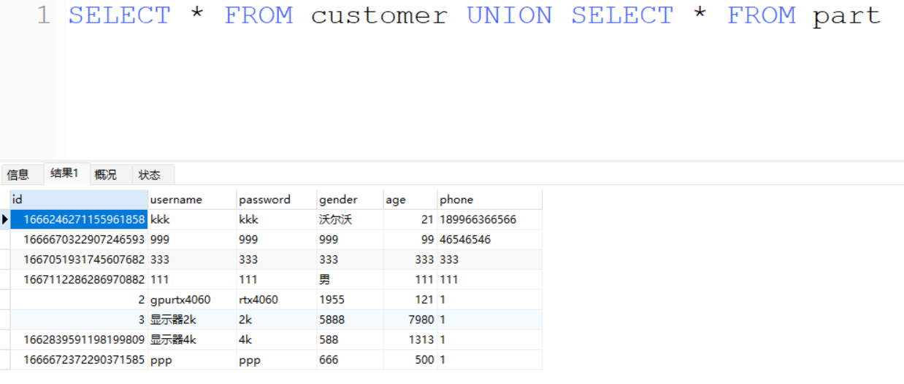
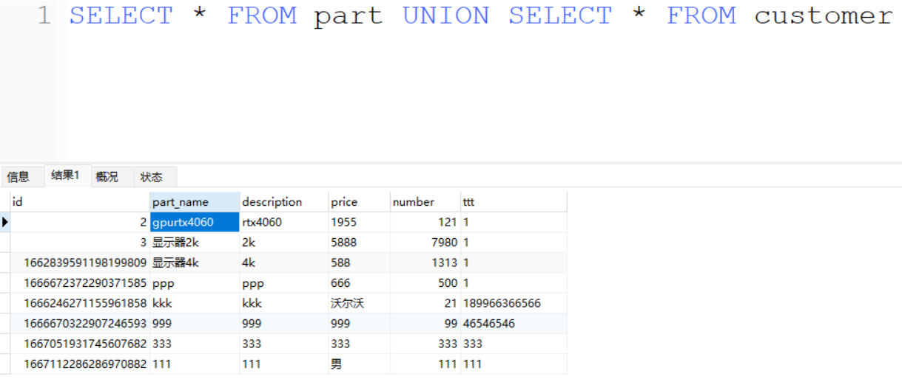
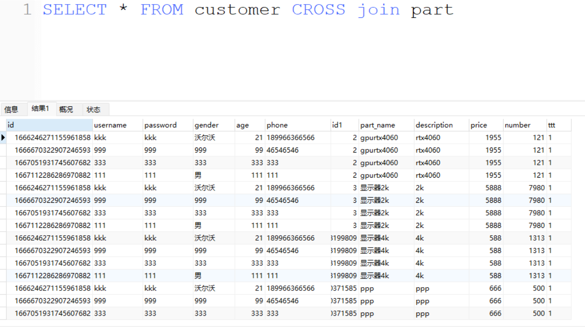
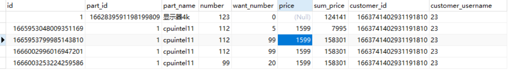
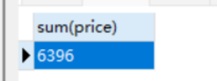
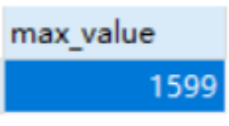
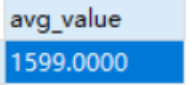

# MySQL

## Basic SQL 

### 1. SELECT 语句

**简单查询**

```sql
SELECT name, age FROM employees;
```

- **说明**：从 `employees` 表中查询 `name` 和 `age` 列的数据。

**带条件的查询**

```sql
SELECT name, age FROM employees WHERE age > 30;
```

- **说明**：查询 `employees` 表中年龄大于 30 的员工的 `name` 和 `age`。

**排序和分组**

```sql
SELECT department, COUNT(*) AS employee_count 
FROM employees 
GROUP BY department 
ORDER BY employee_count DESC;
```

- **说明**：按 `department` 分组，并统计每个部门的员工数量，按数量降序排列。


### 2. INSERT 语句

我的说明：

第一步，插入那个表：insert into xxx

第二步，你插入那些列：（xxx,xxx,......）,不说明的话默认就是所有

第三步，对应你要插入的列，放值：value（xxx,xxx,......）

**简单插入**

```sql
INSERT INTO employees (name, age, department) 
VALUES ('Alice', 28, 'HR');
```

- **说明**：向 `employees` 表中插入一条新记录，姓名为 Alice，年龄 28，部门为 HR。

**多行插入**

```sql
INSERT INTO employees (name, age, department) 
VALUES ('Bob', 35, 'IT'),('Charlie', 32, 'Finance');
```

- **说明**：同时插入两条新记录。


### 3. UPDATE 语句

我的说明：

第一步，更新那一个表：update xxxxxx

第三步，更新条件是什么：where   xxx="xxx"

第二步，改为什么值：set xxx="xxx"

**更新单个字段**

```sql
UPDATE employees SET age = 29 WHERE name = 'Alice';
```

- **说明**：将 `employees` 表中姓名为 Alice 的员工的年龄更新为 29。

**更新多个字段**

```sql
UPDATE employees SET age = 30, department = 'Admin' WHERE name = 'Bob';
```

- **说明**：将 `employees` 表中姓名为 Bob 的员工的年龄更新为 30，部门更新为 Admin。


### 4. DELETE 语句

我的说明：

第一步，删除那个表：delete from xxxx

第二步，删除的条件是什么：where xxxx= "xxxx"

**删除单条记录**

```sql
DELETE FROM employees WHERE name = 'Charlie';
```

- **说明**：删除 `employees` 表中姓名为 Charlie 的记录。

**删除多条记录**

```sql
DELETE FROM employees WHERE department = 'HR';
```

- **说明**：删除 `employees` 表中所有部门为 HR 的记录。

这些例子涵盖了基本的 SQL 操作，可以根据需要进行组合和扩展，以满足更复杂的查询和数据操作需求。


### 5.COUNT

我的说明：

首先，这东西是一个数值的列。记住这一点，sql查询的结果长啥样。


`COUNT` 是一个 SQL 聚合函数，用于统计查询结果中的行数。

#### 1. 基本用法

**COUNT(\*)**

```sql
SELECT COUNT(*) FROM employees;
```

- **说明**：计算 `employees` 表中所有行的总数，包括所有列。


#### 2. 按列计数

**COUNT(column_name)**

```sql
SELECT COUNT(department) FROM employees;
```

- **说明**：统计 `department` 列中非空值的数量。


#### 3. 使用条件过滤

**COUNT(\*) with WHERE**

```sql
SELECT COUNT(*) FROM employees WHERE age > 30;
```

- **说明**：计算 `employees` 表中年龄大于 30 的员工数量。


#### 4. 分组计数

**COUNT(\*) with GROUP BY**

```sql
SELECT department, COUNT(*) FROM employees GROUP BY department;
```

- **说明**：按 `department` 分组，并统计每个部门中的员工数量。

好的，让我们通过一个简单的例子来展示两者的输出结果：

假设 `employees` 表如下：

| name    | department |
| ------- | ---------- |
| Alice   | HR         |
| Bob     | IT         |
| Charlie | Finance    |
| David   | HR         |
| Eve     | IT         |
| Frank   | Finance    |
| Grace   | HR         |

##### 1. 不带 GROUP BY 的查询

```sql
SELECT department, COUNT(*) FROM employees;
```

**输出结果**：

```sql
| department | COUNT(*) |
|------------|----------|
| NULL       | 7        |
```

- 在不带 `GROUP BY` 的情况下，MySQL 返回的是整个表中的总行数。`department` 列因为没有聚合条件，所以显示为 NULL，表示这是对整个表的计数。

##### 2. 带 GROUP BY 的查询

```sql
SELECT department, COUNT(*) FROM employees GROUP BY department;
```

**输出结果**：

```sql
| department | COUNT(*) |
|------------|----------|
| HR         | 3        |
| IT         | 2        |
| Finance    | 2        |
```

- 在带 `GROUP BY department` 的情况下，MySQL 返回每个部门的记录数。每行代表一个部门，显示部门名称和该部门下的员工数量。


#### 5. 结合 HAVING 子句

**COUNT(\*) with GROUP BY and HAVING**

```sql
SELECT department, COUNT(*) 
FROM employees 
GROUP BY department 
HAVING COUNT(*) > 5;
```

- **说明**：按 `department` 分组，统计员工数量，并仅返回员工数超过 5 的部门。


#### 6. 结合 DISTINCT

**COUNT(DISTINCT column_name)**

```sql
SELECT COUNT(DISTINCT department) FROM employees;
```

- **说明**：统计 `department` 列中不同值的数量。

这些例子展示了 `COUNT` 函数的多种用法，从简单计数到复杂的条件过滤和分组计数。可以根据具体需求灵活使用。


### 6.WHERE

区分一下单个条件和多个条件

**简单条件过滤**

```sql
SELECT * FROM employees WHERE department = 'HR';
```

- **说明**：从 `employees` 表中选择所有部门为 'HR' 的员工记录。

**使用多个条件**

```sql
SELECT * FROM employees WHERE department = 'HR' AND age > 30;
```

- **说明**：选择部门为 'HR' 且年龄大于 30 岁的员工记录。


### 7.ORDER BY

我的说明

注意第一个排序后，第二个排序是在第一个的基础之上再进行排序

英文全拼：

`ASC` 的英文全拼是 **Ascending**。

ascending

`DESC` 的英文全拼是 **Descending**。

descending


**按列排序**

```sql
SELECT * FROM employees ORDER BY age DESC;
```

- **说明**：按照年龄降序排列 `employees` 表中的所有记录。

**多列排序**

```sql
SELECT * FROM employees ORDER BY department ASC, age DESC;
```

- **说明**：首先按照部门升序排列，然后在同一部门内按年龄降序排列员工记录。


### 8.GROUP BY


**简单分组**

```SQL
SELECT department, COUNT(*) FROM employees GROUP BY department;
```

- **说明**：按部门分组，计算每个部门的员工数量。

**结合聚合函数**

```sql
SELECT department, AVG(salary) AS avg_salary FROM employees GROUP BY department;
```

- **说明**：按部门分组，计算每个部门的平均工资。


输出结果大概长这个样子：

```sql
department     | avg_salary
---------------|-----------
HR             | 50000.00
Engineering    | 60000.00
Marketing      | 55000.00
```

这里是按照部门分组计算每个部门的平均工资，`department` 列显示部门名称，`avg_salary` 列显示对应部门的平均工资。


## Database SQL

### 10.SHOW DATABASES

要查看 MySQL 中所有的数据库，可以使用以下 SQL 查询语句：

```sql
SHOW DATABASES;
```

这条语句将列出 MySQL 服务器中的所有数据库。

执行这条语句后，你将看到一个包含所有数据库名称的列表。


### 11.CREATE DATABASE

**创建数据库**：

```sql
CREATE DATABASE database_name;
```

这条语句用于创建一个新的数据库。


### 12.DROP DATABASE

**删除数据库**：

```sql
DROP DATABASE database_name;
```

这条语句用于删除一个数据库及其所有相关的表和数据。


### 13.USE

**使用数据库**：

```sql
USE database_name;
```

这条语句用于选择要操作的数据库，后续的查询和操作都将在该数据库上执行。


## Table SQL

### 14.SHOW TABLES

**显示数据库中的所有表**：

```sql
SHOW TABLES;
```

这条语句用于列出当前选定数据库中的所有表。


### 15.CREATE TABLE

**创建表**：

```sql
CREATE TABLE table_name (
    column1 datatype constraints,
    column2 datatype constraints,
    ...
);
```

这条语句用于在当前选定的数据库中创建一个新的表。


### 16.DROP TABLE

**删除表**：

```sql
DROP TABLE table_name;
```

这条语句用于删除数据库中的一个表及其所有数据和结构。


### 16.RENAME TABLE

**重命名表**：

```sql
RENAME TABLE old_table_name TO new_table_name;
```

这条语句用于将一个表重命名为另一个名称。


### 17.DESCRIBE

**查看表结构**：

```sql
DESCRIBE table_name;
```

或者

```sql
DESC table_name;
```

这条语句用于显示表的结构（列名、数据类型、约束等）。


### 18.ALTER

添加表字段

```sql
ALTER TABLE table_name ADD column_name datatype constraints;
```

这条语句用于向现有表中添加新的列。


删除表字段

```sql
ALTER TABLE table_name DROP COLUMN column_name;
```

这条语句用于从现有表中删除指定的列。


# 事务

理解数据库的ACID四个特性可以通过以下类比：

1. **原子性 (Atomicity)**： 想象你在银行提款，要么你成功拿到钱（交易成功），要么交易完全失败，没有任何变化。没有中间状态。
2. **一致性 (Consistency)**： 就像平衡游戏中的积木塔，每次操作后塔都必须稳定。数据库在事务前后都要满足一致的规则和约束。
3. **隔离性 (Isolation)**： 想象在图书馆里借书，不同的人同时借书，但彼此不受影响。每个事务互不干扰，直到完成后才被其他事务看到。
4. **持久性 (Durability)**： 好比写入日记，不管发生什么（如断电），你写入的信息永远不会丢失。事务一旦提交，数据就会被永久保存。

这些类比帮助理解数据库如何处理事务，以确保数据的安全性和一致性。


### 四大特性ACID

1.原子性（Atomicity）：

- 原子性指事务中的所有操作要么全部执行成功，要么全部失败回滚，不允许部分执行成功部分失败。


2.一致性（Consistency）：

- 一致性指事务在执行前后，数据库的完整性约束没有被破坏。即使事务执行失败，数据库状态也会从一个一致的状态转变到另一个一致的状态。


3.隔离性（Isolation）：

- 隔离性指多个事务并发执行时，每个事务的操作应该与其他事务隔离。事务之间应该互不干扰，避免并发执行时引发的问题。


4.持久性（Durability）：

- 持久性指事务一旦提交，其对数据库的修改是永久性的，即使发生系统崩溃或断电等故障，修改的数据也不会丢失。


### 事务过程

在 MySQL 中，事务是通过 `START TRANSACTION`、`COMMIT` 和 `ROLLBACK` 语句来控制的。

- **开始事务**：

  ```mysql
  START TRANSACTION;
  ```

  或者简写为：

  ```sql
  BEGIN;
  ```

- **提交事务**：

  ```sql
  COMMIT;
  ```

- **回滚事务**：

  ```sql
  ROLLBACK;
  ```


# 索引


索引的作用：


索引树包括：

二叉树

平衡二叉树

B树

B+树


# 多表查询

## Union

union可以连接多个查询语句

但是各自的查询结果的列数必须一致

名称一致吗？不需要

但是最终结果第一行咋处理？

谁在前就用谁的


第一个

```sql
SELECT * FROM customer UNION SELECT * FROM part
```

如下



第二个

```sql
SELECT * FROM part UNION SELECT * FROM customer
```

如图




## CROSS JOIN


返回笛卡尔积



什么都合并

表1的数量乘以表2的数量


注意一下：

```sql
SELECT students.name, scores.course_id, scores.score
FROM students
CROSS JOIN scores;
```

等价于

```sql
SELECT students.name, scores.course_id, scores.score
FROM students, scores;
```


## INNER JOIN

也就是join


## LEFT JOIN

主要看左边的数据，左边不可为空，右边可为空


## RIGHT JOIN

主要看右边数据，右边不可为空，左边可以为空


# 函数

## 数字函数

### 聚合函数

我们以下图为例：



#### count

```sql
select count(price) from booking
```

结果是  4 

也就是：price这一列的非空值的个数。


```sql
select count(price) from booking
```

结果是 5

也就是：一共有多少行


#### sum


```sql
SELECT sum(price) FROM booking
```

结果：



也就是：计算这一列数字值之和


#### max


```
SELECT max(price) as max_value FROM booking
```

结果



也就是：选出这一列的最大值


#### min

与max类似


#### avg

```sql
SELECT avg(price) as avg_value FROM booking
```

结果



也就是：算出这一列的平均值


# LIMIT

作用：数量限制

如何查询学生信息表后面30条数据呢？

```sql
select * from student order by desc limit 30;
```


# truncateVSdelete

`truncate`和`delete`是用来删除表中数据的两种常见操作，它们之间有几个重要的区别：

1. **执行速度**：
   - `truncate` 操作通常比 `delete` 操作快，因为它不会逐行删除数据，而是直接删除整个表的数据并释放存储空间。
   - `delete` 操作会逐行删除数据，并且可以带有条件，这可能会花费更多的时间，特别是在大型表中。
2. **事务和日志**：
   - `truncate` 是一个DDL（数据定义语言）操作，它以原子方式删除表中的所有行，并且不能回滚。它也不会在事务日志中记录每一行的删除操作。
   - `delete` 是一个DML（数据操作语言）操作，它可以在事务中使用，并且可以回滚。每一行删除操作都会被记录在事务日志中，可以进行数据恢复或者回滚。
3. **影响**：
   - `truncate` 会重置表的计数器（例如自增主键），并且不会触发触发器。
   - `delete` 操作会逐行触发触发器，并且不会重置自增主键计数器。
4. **权限**：
   - `truncate` 需要 `ALTER` 表的权限，因为它是一个DDL操作。
   - `delete` 操作只需要 `DELETE` 权限即可执行。

`drop table_name`直接删除表，结构和数据

`delete from table where xxx=xxx`

`truncate table_name`，直接删除表的数据，保留结构


