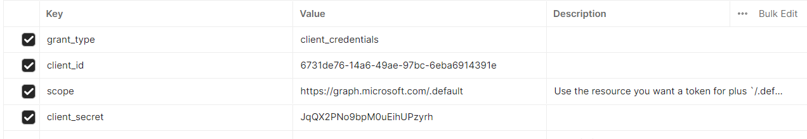
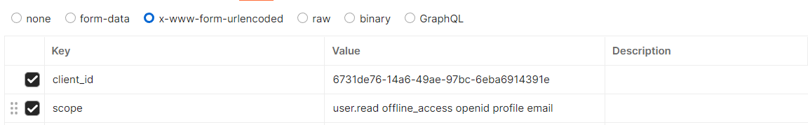
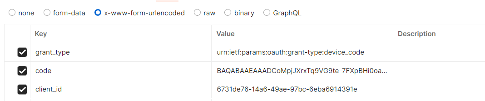

首先第一中最简单的

# implicit  flow

隐式流

## 1

用户访问客户端，后者将用户重定向到授权服务器。

客户端——>授权服务器

```http
https://login.microsoftonline.com/common/oauth2/v2.0/authorize?client_id=6731de76-14a6-49ae-97bc-6eba6914391e&
response_type=id_token+token&
redirect_uri=http%3A%2F%2Flocalhost%2Fmyapp%2F&
scope=openid%20https%3A%2F%2Fgraph.microsoft.com%2Fmail.read&
response_mode=fragment&
state=12345&
nonce=678910
```

参数

`client_id`=6731de76-14a6-49ae-97bc-6eba6914391e&

`response_type`=id_token+token&

`redirect_uri`=http%3A%2F%2Flocalhost%2Fmyapp%2F&

`scope`=openid%20https%3A%2F%2Fgraph.microsoft.com%2Fmail.read&

`response_mode`=fragment&

`state`=12345&

`nonce`=678910


## 2

用户在授权服务器上登录并同意授权。


## 3

授权服务器——>客户端

授权服务器将用户重定向回客户端，并附带访问令牌。

```http
https://login.microsoftonline.com/common/oauth2/v2.0/authorize?client_id=6731de76-14a6-49ae-97bc-6eba6914391e&
response_type=token&
redirect_uri=http%3A%2F%2Flocalhost%2Fmyapp%2F&
scope=https%3A%2F%2Fgraph.microsoft.com%2Fmail.read&
response_mode=fragment&
state=12345&
nonce=678910&
prompt=none&
login_hint={{your-username}}
```

参数

`client_id`=6731de76-14a6-49ae-97bc-6eba6914391e&

`response_type`=token&

`redirect_uri`=http%3A%2F%2Flocalhost%2Fmyapp%2F&

`scope`=https%3A%2F%2Fgraph.microsoft.com%2Fmail.read&

`response_mode`=fragment&

`state`=12345&

`nonce`=678910&

`prompt`=none&

`login_hint`={{your-username}}


# openid connect sign-in

## 1

用户访问客户端，后者将用户重定向到 OpenID 提供者（OP）。

客户端——op

```http
https://login.microsoftonline.com/common/oauth2/v2.0/authorize?client_id=6731de76-14a6-49ae-97bc-6eba6914391e&
response_type=id_token&
redirect_uri=http%3A%2F%2Flocalhost%2Fmyapp%2F&
scope=openid&
response_mode=form_post&
state=12345&
nonce=678910
```

参数

`response_type`=id_token&

`redirect_uri`=http%3A%2F%2Flocalhost%2Fmyapp%2F&

`scope`=openid&

`response_mode`=form_post&

`state`=12345&

`nonce`=678910


## 2

用户在 OP 上登录并同意授权。


## 3

OP 将用户重定向回客户端，并附带一个 ID 令牌和可能的访问令牌。

op——客户端

```http
https://login.microsoftonline.com/common/oauth2/v2.0/authorize?client_id=6731de76-14a6-49ae-97bc-6eba6914391e&
response_type=id_token+code&
redirect_uri=http%3A%2F%2Flocalhost%2Fmyapp%2F&
response_mode=form_post&
scope=openid%20offline_access%20https%3A%2F%2Fgraph.microsoft.com%2Fmail.read&
state=12345&
nonce=678910
```

参数

`client_id`=6731de76-14a6-49ae-97bc-6eba6914391e&

`response_type`=id_token+code&

`redirect_uri`=http%3A%2F%2Flocalhost%2Fmyapp%2F&

`response_mode`=form_post&

`scope`=openid%20offline_access%20https%3A%2F%2Fgraph.microsoft.com%2Fmail.read&

`state`=12345&

`nonce`=678910


## 4

客户端验证 ID 令牌，并使用访问令牌访问受保护资源。


# client credentials flow

## 1

客户端使用其客户端凭据（Client ID 和 Client Secret）向授权服务器申请访问令牌。

```http
https://login.microsoftonline.com/{tenant}/oauth2/v2.0/token
```

参数




## 2

用户确认请求

```
https://login.microsoftonline.com/{tenant}/adminconsent?
client_id=6731de76-14a6-49ae-97bc-6eba6914391e&
state=12345&
redirect_uri=http://localhost/myapp/permissions
```

参数

`client_id`=6731de76-14a6-49ae-97bc-6eba6914391e&

`state`=12345&

`redirect_uri`=`http://localhost/myapp/permissions`


# device flow

## 1

用户在设备上启动登录流程，设备向授权服务器请求设备码和用户代码。

Device Authorization Request

设备到授权服务器

```
https://login.microsoftonline.com/organizations/oauth2/v2.0/devicecode
```

参数




## 2

Device Access Token Request

```
https://login.microsoftonline.com/organizations/oauth2/v2.0/token
```

参数




