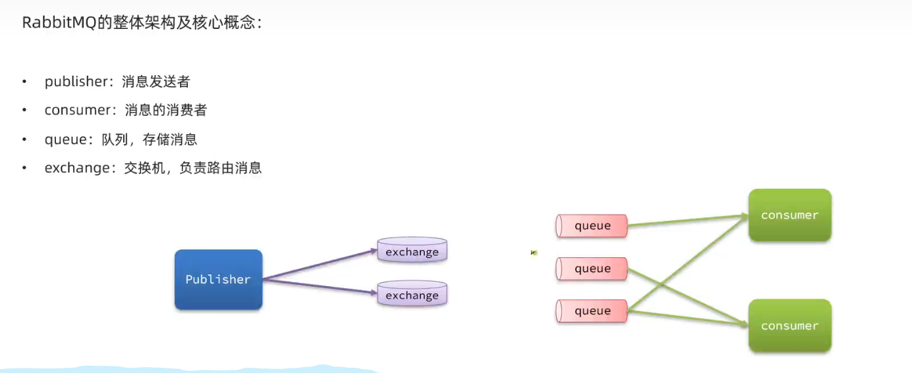

# 同步和异步

同步的问题：

- 拓展性差
- 性能下降
- 级联失败问题

异步调用的优缺点

# MQ技术选型

如下

安装rabbitmq

先安装编程语言

然后安装这个windows版本的rabbitmq

接着再sever中进入管理员的cmd模式

输入

**rabbitmq-plugins.bat enable rabbitmq_management**

在输入

**net stop rabbitmq && net start rabbitmq**

然后访问[http://localhost:15672](http://localhost:15672/)

如下图所示

然后构建集群

# 数据隔离

# springAMQP

# work模式

# MQ消息转换器

# 发布订阅模式

# 消息堆积问题处理