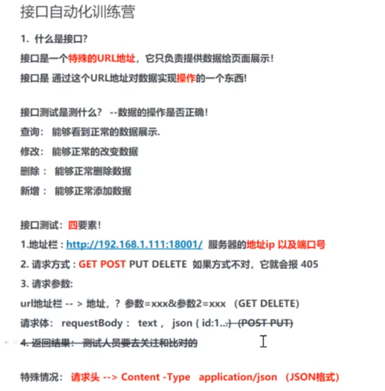

# 测试分类

测试可以分为以下几类：


存在不存在

有效不有效

 

## 弱网测试


## 单元测试

Unit Testing


## 集成测试

Integration Testing


## 黑盒测试

Black Box Testing

又称功能测试。

只按照程序的说明书进行测试，看功能是否符合功能需求。

通过输入输出判断逻辑是否正确

### 测试方法

黑盒测试是一种软件测试方法，其测试过程不考虑软件的内部结构和实现细节，而是关注软件的功能和行为是否符合预期。常见的黑盒测试方法包括等价类划分、边界值分析、决策表、状态迁移图、因果图和错误推测等。以下是每个方法的简要介绍和生动例子：

1. **等价类划分（Equivalence Partitioning）**：
   - **介绍**：将输入数据划分为若干个等价类，每个类中的数据被认为是等效的，对一个类中的任意一个数据进行测试，都可以代表该类的数据。
   - 例子：假设有一个年龄输入框，要求输入1到120之间的整数。那么可以将输入数据划分为以下等价类：
     - 合法等价类：1-120之间的整数（如25）
     - 非法等价类：小于1的数（如0），大于120的数（如121），以及非整数（如“abc”）
   - 
   - 总结：规范的（合法的）输入与不规范（不合法）的输入
   
   
2. **边界值分析（Boundary Value Analysis）**：
   - **介绍**：测试输入数据的边界值，包括最大值、最小值及其邻近值，因为边界值往往容易引发错误。
   - 例子：对于年龄输入框的例子，边界值测试可以包括：
     - 最小边界值：1及其邻近值0和2
     - 最大边界值：120及其邻近值119和121
   - 
   - 总结：看最大值、最小值、临近值
   
   
3. **决策表（Decision Table）**：
   - **介绍**：通过列出所有可能的输入组合及其对应的输出，系统化地检查各个条件及其组合对系统行为的影响。
   - 例子：假设一个在线购物系统，根据会员等级和购买金额提供不同的折扣。决策表可以如下：
     - 非会员，购买金额<100元，无折扣
     - 非会员，购买金额≥100元，10%折扣
     - 会员，购买金额<100元，10%折扣
     - 会员，购买金额≥100元，20%折扣
   - 
   - 总结：看所有可能的输出和输出组合
   
   
4. **状态迁移图（State Transition Testing）**：
   - **介绍**：测试系统在不同状态之间的转换，验证系统在各种状态转换情况下的行为是否正确。
   - 例子：假设一个简单的电梯系统，有“停止”和“运行”两种状态。状态迁移图可以如下：
     - 电梯停止 -> 按下“运行”按钮 -> 电梯运行
     - 电梯运行 -> 按下“停止”按钮 -> 电梯停止
   - 
   - 总结：不同状态切换
   
   
5. **因果图（Cause-Effect Graphing）**：
   - **介绍**：通过绘制因果图来确定输入条件（原因）和系统行为（结果）之间的关系，以确保所有可能的条件组合都被测试。
   - 例子：假设一个登录系统，用户输入用户名和密码。如果用户名和密码都正确，则登录成功；如果用户名或密码错误，则登录失败。因果图可以展示：
     - 因（用户名正确）：True 或 False
     - 因（密码正确）：True 或 False
     - 果（登录成功）：True 或 False
   - 
   - 总结：
   
   
6. **错误推测（Error Guessing）**：
   - **介绍**：基于经验和直觉，猜测系统中可能存在的错误，并有针对性地设计测试用例。
   - 例子：在测试一个计算器应用时，测试人员可能会猜测并测试如下错误：
     - 除以零是否会导致程序崩溃
     - 输入非常大的数字是否会导致溢出错误
     - 输入特殊字符是否会导致异常
   - 
   - 总结：
   
   

通过这些方法，测试人员可以有效地发现软件中的缺陷，提高软件的质量。


## 白盒测试

White Box Testing

通过检测逻辑来判断输入输出是否正确

### 测试方法

白盒测试（White-box Testing），也称为结构化测试或玻璃盒测试，是一种通过了解软件内部结构和逻辑来设计测试用例的方法。白盒测试关注代码的逻辑路径、条件、循环和数据流等。常见的白盒测试方法包括语句覆盖、分支覆盖、路径覆盖、条件覆盖、循环覆盖和数据流分析等。以下是每个方法的简要介绍和生动例子：

1. **语句覆盖（Statement Coverage）**：

   - **介绍**：测试用例设计的目标是执行代码中的每一条语句至少一次，以确保每条语句都经过测试。

   - 例子：

     ```python
     def is_even(num):
         if num % 2 == 0:
             return True
         else:
             return False
     ```

     为了覆盖所有语句，可以设计以下测试用例：

     - 输入：2（语句 `if num % 2 == 0:` 和 `return True` 被执行）
     - 输入：3（语句 `if num % 2 == 0:` 和 `return False` 被执行）

   - 

   - 总结：所有的语句都要最少执行一次

   

2. **分支覆盖（Branch Coverage）**：

   - **介绍**：测试用例设计的目标是执行代码中的每一个分支，即使所有条件的真值和假值都被覆盖。

   - 例子：

     ```python
     def check_sign(num):
         if num > 0:
             return "positive"
         elif num < 0:
             return "negative"
         else:
             return "zero"
     ```

     为了覆盖所有分支，可以设计以下测试用例：

     - 输入：5（覆盖 `num > 0` 分支）
     - 输入：-3（覆盖 `num < 0` 分支）
     - 输入：0（覆盖 `else` 分支）

   - 

   - 总结：所有的if判断分支都要走

   

3. **路径覆盖（Path Coverage）**：

   - **介绍**：测试用例设计的目标是执行代码中的所有可能路径，以确保每条路径都经过测试。

   - 例子：

     ```python
     def find_max(a, b, c):
         if a > b:
             if a > c:
                 return a
             else:
                 return c
         else:
             if b > c:
                 return b
             else:
                 return c
     ```

     为了覆盖所有路径，可以设计以下测试用例：

     - 输入：3, 2, 1（路径：`a > b` -> `a > c`）
     - 输入：1, 2, 3（路径：`a <= b` -> `b <= c`）
     - 输入：2, 3, 1（路径：`a <= b` -> `b > c`）
     - 输入：3, 1, 2（路径：`a > b` -> `a <= c`）

   - 

   - 总结：都属于if判断

   

4. **条件覆盖（Condition Coverage）**：

   - **介绍**：测试用例设计的目标是执行代码中的每一个条件的所有可能取值（真/假）。

   - 例子：

     ```python
     def is_valid(age, height):
         if age >= 18 and height >= 160:
             return True
         else:
             return False
     ```

     为了覆盖所有条件，可以设计以下测试用例：

     - 输入：20, 170（`age >= 18` 为真，`height >= 160` 为真）
     - 输入：16, 170（`age >= 18` 为假，`height >= 160` 为真）
     - 输入：20, 150（`age >= 18` 为真，`height >= 160` 为假）
     - 输入：16, 150（`age >= 18` 为假，`height >= 160` 为假）

   - 

   - 总结：都属于if判断

   

5. **循环覆盖（Loop Coverage）**：

   - **介绍**：测试用例设计的目标是执行代码中的所有循环结构，包括零次、一至多次的循环执行。

   - 例子：

     ```python
     def sum_first_n(n):
         total = 0
         for i in range(n):
             total += i
         return total
     ```

     为了覆盖循环，可以设计以下测试用例：

     - 输入：0（循环执行零次）
     - 输入：1（循环执行一次）
     - 输入：5（循环执行多次）

   - 

   - 总结：对与循环的测试，要看循环是否健壮

   

6. **数据流分析（Data Flow Analysis）**：

   - **介绍**：测试用例设计的目标是追踪变量的定义、使用和销毁，确保变量在程序中的使用是正确的。

   - 例子：

     ```python
     def calculate_discount(price):
         discount = 0.1  # 定义
         if price > 100:
             discount = 0.2  # 定义
         return price * (1 - discount)  # 使用
     ```

     为了分析数据流，可以设计以下测试用例：

     - 输入：50（变量 `discount` 使用初始定义值）
     - 输入：150（变量 `discount` 使用重新定义值）

   - 

   - 总结：

通过这些白盒测试方法，可以深入了解和验证代码的内部逻辑和结构，提高软件的可靠性和质量。


## 静态测试

Static Testing


## 动态测试

Dynamic Testing


## 手工测试

Manual Testing


## 自动测试

Automated Testing


## 冒烟测试

Smoke Testing


## 公测（Beta测试的策略）

Public Testing


## 功能测试

验证软件功能是否符合需求，包括用户界面、操作流程等。


## 性能测试

评估软件在不同负载下的响应时间、吞吐量和稳定性。


QPS（Queries Per Second）、TPS（Transactions Per Second）、并发用户数和吞吐量是性能测试和负载测试中常用的指标，它们属于性能测试和负载测试领域的重要知识。让我们逐个解释它们的含义及其关系：


### QPS

**QPS（Queries Per Second）**：

- QPS 表示每秒钟处理的查询（或请求）数量。在数据库或应用程序性能测试中，QPS用于衡量系统每秒能够处理的查询请求数量。通常用来评估系统在处理读取型操作时的性能。


### TPS

**TPS（Transactions Per Second）**：

- TPS 表示每秒钟完成的事务数量。事务可以是一个完整的业务操作单元，比如一次完整的支付操作或订单提交操作。在负载测试中，TPS通常用于衡量系统在处理事务型操作时的性能。


### CC

并发用户数：concurrent users

**并发用户数**：

- 并发用户数是同时向系统发送请求的用户数量。
- 在负载测试中，通过模拟多个用户并发访问系统，可以评估系统在高并发情况下的性能表现。并发用户数越高，系统处理请求的能力需求越大。


### Throughput

吞吐量：Throughput

**吞吐量**：

- 吞吐量是系统在单位时间内处理的总请求数量或数据量。
- 它反映了系统的总体处理能力。吞吐量的计算可以涵盖所有请求，不仅限于读取操作或事务。


### 区别

#### 关系和应用场景

- **QPS 和 TPS**：
  - QPS 和 TPS 是衡量系统性能的两个常见指标，通常用于评估系统在不同负载下的响应能力。QPS 适用于读取操作比较多的场景，如数据库查询；TPS 更适用于包含多个步骤或事务的完整业务操作，如支付或提交订单。
- **并发用户数和吞吐量**：
  - 并发用户数影响系统的负载，多个并发用户同时访问系统会增加系统的压力。吞吐量则反映了系统在这些并发用户情况下的总体处理能力，包括读取操作、事务处理等。


Qps 基本类似于 Tps，但是不同的是，对于一个页面的一次访问，形成一个 Tps；但一次页面请求，可能产生多次对服务器的请求，服务器对这些请求，就可计入“Qps”之中。

**例子：**

例如，访问一个 Index 页面会请求服务器 3 次，包括一次 html，一次 css，一次 js，那么访问这一个页面就会产生一个“T”，产生三个“Q”。


## 接口测试

检查系统组件或模块间的交互，确保数据交换正确。




## 安全测试

评估软件的安全性，包括漏洞检测、权限验证等。


## 兼容性测试

验证软件在不同操作系统、浏览器或设备上的表现。


## 可用性测试

检查用户界面的易用性和用户体验。


## 回归测试

确保新代码修改未引入新的缺陷。


### 确定权重

确定回归测试中各个测试用例的权重是一个重要且有挑战性的任务，它直接影响到测试资源的分配和测试执行的优先级。权重的确定可以根据以下几个方面来考虑和确定：

1. **业务影响度**：
   - 测试用例对业务的影响程度是确定权重的一个关键因素。通常来说，对核心业务流程影响较大的测试用例应当赋予更高的权重。例如，涉及支付、订单处理、用户注册等核心功能的测试用例可能比较关键，因此应该有较高的权重。
2. **功能复杂度**：
   - 如果某个功能或模块较为复杂，其涉及的测试用例可能相对重要。复杂度高的功能可能意味着潜在的更多问题和影响面广，因此相关的测试用例可以赋予较高的权重。
3. **测试覆盖范围**：
   - 测试用例的覆盖范围也应考虑在内。覆盖多个功能点或涉及多个系统集成的测试用例可能对整体系统稳定性和兼容性的验证更为重要，因此可以考虑赋予较高的权重。
4. **历史缺陷和风险**：
   - 历史上已经发现的缺陷和问题，以及相关的风险分析，也可以作为确定权重的依据。如果某个功能或模块曾经出现过较多或严重的问题，相关的测试用例可能需要更多的关注和测试覆盖，因此可以赋予较高的权重。
5. **用户反馈和需求优先级**：
   - 根据用户的反馈和需求优先级，确定哪些功能或场景对用户体验和业务需求的重要性较高。相关的测试用例可以根据这些优先级来赋予权重。
6. **技术实现和变更的影响**：
   - 考虑技术实现的复杂性和变更的影响范围。技术实现较为复杂或者变更影响面广的功能，可能需要更多的测试覆盖和测试深度，因此相关的测试用例可以赋予较高的权重。

#### 方法和策略：

- **主观评估和专家意见**：
  - 可以组织项目团队或者相关领域的专家进行讨论和评估，结合上述因素进行主观的权重评定。这种方法可以根据具体项目和业务情况进行调整和优化。
- **量化分析和分级**：
  - 可以采用数值化的方法对测试用例进行打分或分级，例如基于1到10的打分系统，根据各个因素对测试用例进行评分，最后汇总计算权重。这种方法可以更加客观地衡量和比较不同测试用例的重要性。
- **自动化工具支持**：
  - 有些测试管理工具和质量管理平台提供了权重分配和优先级管理的功能，可以利用这些工具来帮助管理和调整测试用例的权重。

综上所述，确定回归测试中测试用例的权重是一个结合多方面因素进行评估和决策的过程。根据具体项目的需求和特点，可以采用不同的方法和策略来确保测试资源的有效利用和测试效果的最大化。


### 回归哪些

回归测试通常指的是在软件经过修改或更新后，为了确认修改没有引入新问题或未预期的影响，而重新运行既有的测试用例集合。需要进行回归测试的情况主要包括以下几种：

1. **代码修改**：
   - 当开发团队对软件的代码进行了修改，包括功能增加、bug修复、性能优化等，都需要进行回归测试以确保修改后的代码不会影响到原有的功能和已验证的业务逻辑。
2. **配置变更**：
   - 如果软件的配置文件、数据库结构或者第三方服务的配置发生了变更，可能会影响到软件的功能或性能，需要进行回归测试来验证变更后的配置与系统的兼容性和稳定性。
3. **环境变更**：
   - 当软件运行的环境发生变化，如操作系统升级、数据库版本更新、硬件设备更换等，这些变更可能会对软件的运行产生影响，需要进行回归测试来确认系统在新环境下的表现。
4. **新功能集成**：
   - 当引入新的功能或模块到现有的软件系统中时，需要进行回归测试来验证新功能与现有功能的集成是否正常，以及是否对已有功能产生了不良影响。
5. **修复缺陷**：
   - 在发现和修复软件中的缺陷后，需要进行回归测试来验证缺陷的修复是否有效，同时确保修复过程没有引入新的问题或影响到其他功能。
6. **版本发布**：
   - 在准备发布新版本或补丁之前，需要进行回归测试来确认整体系统在新版本中的稳定性和功能完整性，以便保证发布版本的质量和用户体验。
7. **周期性测试**：
   - 对于长期维护的软件项目，通常会定期进行回归测试，以确保系统在长时间演变中保持稳定性和功能完整性。
8. **自动化测试更新**：
   - 如果软件的自动化测试脚本或测试框架发生了变更或更新，需要进行回归测试以验证新的自动化测试是否准确地覆盖了系统的功能和变化点。

总体而言，回归测试是确保软件质量和稳定性的重要手段，涵盖了软件生命周期中多个阶段和多种情况。通过有效的回归测试，可以最大程度地减少新版本发布后因变更而引入的风险和问题。


---

ps

---

回归测试怎么确定权重?哪些需要回归?

在回归测试中确定权重和选择哪些测试需要回归可以通过以下方法：

1. **影响分析**：
   - 确定代码修改对哪些模块和功能有影响。
   - 根据影响范围和重要性，分配不同的权重。
2. **测试覆盖率**：
   - 优先选择覆盖关键业务功能和高风险区域的测试用例。
3. **历史缺陷**：
   - 参考过去的缺陷数据，重点测试曾经出问题的模块。
4. **模块复杂性**：
   - 复杂度较高的模块可能更容易引入缺陷，因此需要更高的权重。
5. **频繁变更的模块**：
   - 频繁更改的部分应重点回归，因为它们更容易受到新缺陷的影响。

通过这些方法，可以合理安排回归测试的重点和顺序，确保测试的有效性和效率。


## 负载测试

检查系统在高负载下的性能。


## 压力测试

评估系统在极限条件下的稳定性。


## 烟雾测试

快速验证软件的基本功能是否正常。


这些测试类型可以帮助确保软件的质量和可靠性。

