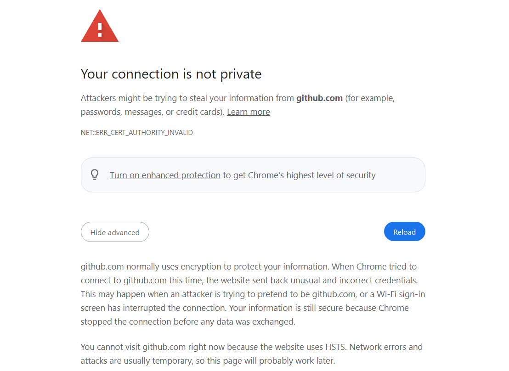
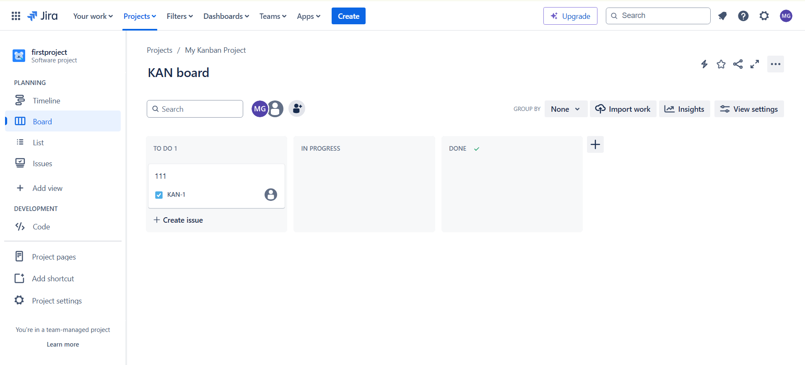

# Fiddler

启动 Fiddler ，它会作为一个`本地代理服务器`，监听指定的端口（默认是8888）。

`自动修改`操作系统的网络配置，将自己设置为`系统的代理服务器`。

HTTP 或 HTTPS 首先发送到 Fiddler 代理服务器。

HTTPS 请求，Fiddler 会使用其自己生成的`根证书（Fiddler 根证书）`来解密 HTTPS 

Fiddler可以修改请求包和响应包的各种信息


# POSTMAN


# ADB

adb常用指令：

```powershell
> adb shell
```

进入手机的shell界面。

## PM

pm，包管理工具

```bash
HWHLK-H:/ $ pm
Package manager (package) commands:
······
```

指令如下：

```bash
$ pm list packages#(或者package)
```

列出手机安装的所有apk（也就是包）


## Monkey

```bash
HWHLK-H:/ $ monkey
args: []
usage: monkey [-p ALLOWED_PACKAGE [-p ALLOWED_PACKAGE] ...]
              [-c MAIN_CATEGORY [-c MAIN_CATEGORY] ...]
              [--ignore-crashes] [--ignore-timeouts]
              [--ignore-security-exceptions]
              [--monitor-native-crashes] [--ignore-native-crashes]
              [--kill-process-after-error] [--hprof]
              [--match-description TEXT]
              [--pct-touch PERCENT] [--pct-motion PERCENT]
              [--pct-trackball PERCENT] [--pct-syskeys PERCENT]
              [--pct-nav PERCENT] [--pct-majornav PERCENT]
              [--pct-appswitch PERCENT] [--pct-flip PERCENT]
              [--pct-anyevent PERCENT] [--pct-pinchzoom PERCENT]
              [--pct-permission PERCENT]
              [--pkg-blacklist-file PACKAGE_BLACKLIST_FILE]
              [--pkg-whitelist-file PACKAGE_WHITELIST_FILE]
              [--wait-dbg] [--dbg-no-events]
              [--setup scriptfile] [-f scriptfile [-f scriptfile] ...]
              [--port port]
              [-s SEED] [-v [-v] ...]
              [--throttle MILLISEC] [--randomize-throttle]
              [--profile-wait MILLISEC]
              [--device-sleep-time MILLISEC]
              [--randomize-script]
              [--script-log]
              [--bugreport]
              [--periodic-bugreport]
              [--permission-target-system]
              COUNT

```

这是使用说明。


```bash
$ monkey 10
```

模拟10次随机的操作事件。


```bash
$ monkey -p com.taobao.taobao 20
```

这个意思就是，针对这个包，做20个随机事件。


# CHARLES

长得像西欧水瓶子

这东西也是个抓包的

很显然https要配置证书，仅此而已

但是这东西一开我的电脑的流量就全被接管了

接着我的chrome上哔站就会出现问题



当然牛逼点的就会去分析这个问题的各种成因

我也牛逼，但是我懒

## 弱网测试配置

`Proxy`**-->**`Throttle Settings`

配置弱网的内容


# JMETER

一个纯java写的工具，可以上压力测试。

但是对于测试后的结果进行判断不是一件容易的事.


## sampler

模拟请求

- **Thread Group** 是最常用的线程组，用于定义并发用户和执行测试脚本。
- **setUp Thread Group** 在`执行前`运行，用于初始化测试环境。
- **tearDown Thread Group** 在`执行后`运行，用于清理测试环境。
- **Open Model Thread Group** 是用于动态调整并发用户数以`模拟真实用户行为模式`的特殊线程组。


## logic controller

控制samplers

## pre processors

请求数据预处理

## post processors

响应数据预处理

## assertions

对响应数据做断言

## timer

模拟请求时间间隔

## test fragment


## config element

各种测试的配置，包括：

- `http header manager`

- `http cookie manager`

- `http cache manager`

- `http request defaults`

- `csv data set config`

- `dns cache manager`

- `ftp request default`

- `jdbc connection configuration`

- `java request default`


## listener

监听显示结果


# JIRA

打开长这样



我也不是知道这东西怎么用


# PYTEST

给你个例子：

math_operations.py

```python
# math_operations.py

def add_numbers(a, b):
    return a + b

```

test_math_operations.py

```python
# test_math_operations.py
import pytest

import math_operations


def test_add_numbers():
    assert math_operations.add_numbers(2, 3) == 5
    assert math_operations.add_numbers(-1, 1) == 0
    assert math_operations.add_numbers(-1, -1) == -2
    assert math_operations.add_numbers(0, 0) == 0


if __name__ == "__main__":
    pytest.main()

```

然后就运行就行。


# Selenium

### 工作原理

我的说明：

- 首先，windows下载这个driver，放在python和chrome的目录下。


- 配置chrome到环境变量。


- 然后pip安装selenium


接着python代码就可以运行这些东西了，甚至不需要指定什么driver路径。

过程如下：

1. 测试脚本向 `WebDriver`(selenium的元素) 发送命令。
2. `WebDriver` 将命令传递给浏览器驱动(`ChromeDriver`)。
3. 浏览器驱动与浏览器通信，执行相应操作。
4. 执行结果返回给 WebDriver，供测试脚本验证。


### 定位元素

selenium定位元素的方法都有哪些

Selenium 定位元素的方法包括：

1. **ID**
2. **Name**
3. **Class Name**
4. **Tag Name**
5. **Link Text**
6. **Partial Link Text**
7. **CSS Selector**
8. **XPath**


我的代码如下：

```python
from selenium import webdriver
from selenium.webdriver.common.by import By
from selenium.webdriver.support.ui import WebDriverWait
from selenium.webdriver.support import expected_conditions as EC
import time


def login():
    driver = webdriver.Chrome()
    wait = WebDriverWait(driver, 10)  # 设置等待时间为10秒

    try:
        while True:
            # 打开登录页面
            driver.get('http://127.0.0.1:5000/')

            # 等待登录按钮出现
            login_button = wait.until(
                EC.presence_of_element_located((By.ID, 'button'))
            )

            # 点击登录按钮
            login_button.click()

            # 等待页面加载完全
            wait.until(
                EC.invisibility_of_element_located((By.ID, 'loading'))
            )  # 假设有加载动画，等待加载完成

            # 检测当前页面是否还在登录页面，如果不是则认为登录成功
            if 'login' not in driver.current_url:
                print('登录成功！')
                time.sleep(10)  # 登录成功后等待5秒

            # 否则，重新加载页面，继续检测登录状态
            driver.refresh()

    except Exception as e:
        print(f"登录失败：{e}")

    finally:
        driver.quit()


# 示例使用
if __name__ == "__main__":
    login()

```


# Robot Framework

首先写一个flask web程序

```python
from flask import Flask, request, render_template_string, redirect, url_for

app = Flask(__name__)

# In-memory user database
users = {
    "testuser": "testpassword"
}


@app.route('/')
def home():
    return 'Welcome to the Simple Login System'


@app.route('/login', methods=['GET', 'POST'])
def login():
    if request.method == 'POST':
        username = request.form['username']
        password = request.form['password']
        if username in users and users[username] == password:
            return render_template_string(
                '<h1>Welcome, {{ username }}</h1>', username=username
            )
        else:
            return 'Invalid credentials', 401
    return '''
        <form method="post">
            Username: <input type="text" name="username"><br>
            Password: <input type="password" name="password"><br>
            <input type="submit" value="Login">
        </form>
    '''


if __name__ == '__main__':
    app.run(debug=True)

```

然后是robot framework

项目结构

```apl
project/
    ├── tests/
    │   └── login_test.robot
    └── resources/
        ├── keywords.robot
        └── variables.robot
```

`login_test.robot`

```r
*** Settings ***
Resource    ../resources/keywords.robot
Resource    ../resources/variables.robot

*** Test Cases ***
Test Valid Login
    [Documentation]    测试有效的用户登录
    Open Login Page
    Perform Login    testuser    testpassword
    Verify Login Successful    testuser

Test Invalid Login
    [Documentation]    测试无效的用户登录
    Open Login Page
    Perform Login    invaliduser    invalidpassword
    Wait Until Page Contains    Invalid credentials
    Close Browser

```

`keywords.robot`

```r
*** Settings ***
Library    SeleniumLibrary

*** Keywords ***
Open Login Page
    Open Browser    ${BASE_URL}/login    ${BROWSER}
    Wait Until Page Contains Element    name=username

Perform Login
    [Arguments]    ${username}    ${password}
    Input Text    name=username    ${username}
    Input Text    name=password    ${password}
    Click Button    xpath=//input[@type="submit"]

Verify Login Successful
    [Arguments]    ${username}
    Wait Until Page Contains    Welcome, ${username}
    Close Browser

```

`variables.robot`

```r
*** Variables ***
${BASE_URL}    http://127.0.0.1:5000
${BROWSER}     Chrome

```

然后

```bash
$ robot login_test.robot
```


# 13个常用的测试工具


webdriverIO

cypress


earlgrey

appium

serenity

cucumber

citrus

galen框架

carina

gauge

sahi

