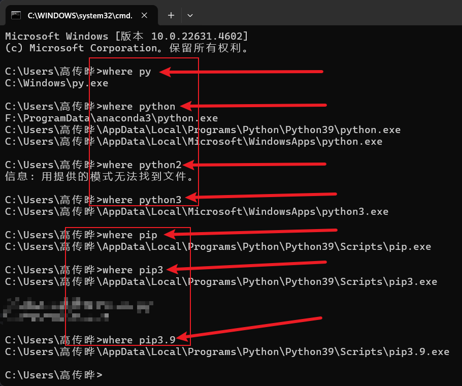
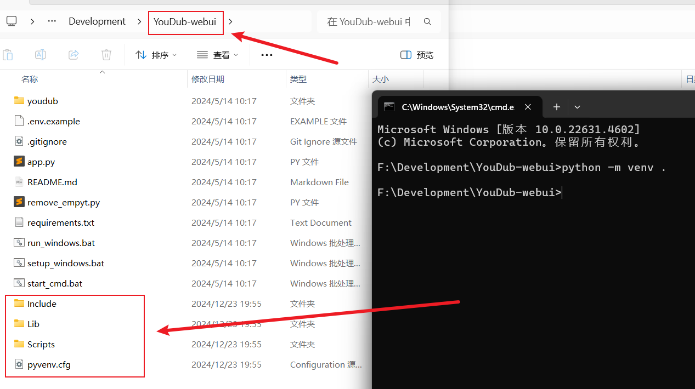
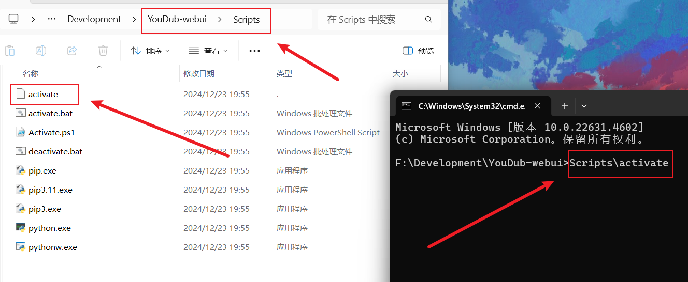
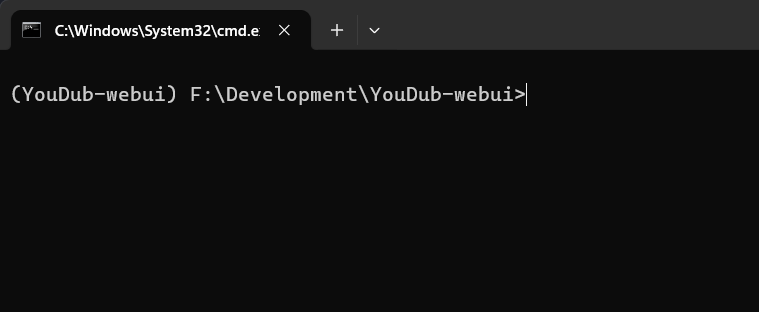
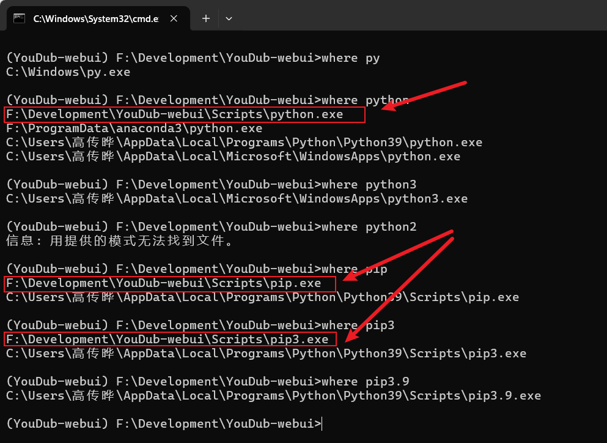

## 首先是激活虚拟环境

先看本机的python和pip的环境



然后呢，为我们的这个项目创建一个虚拟环境：

```cmd
python -m venv .
```

如图：



然后呢，接下来就要开始进入这个虚拟环境来操作了

```cmd
Scripts\activate
```

切记是`反斜杠`

如图



然后就进入虚拟环境了




这时候来看python和pip的环境



这是where展示的，基本上我们使用python和pip都是我们虚拟环境的东西

